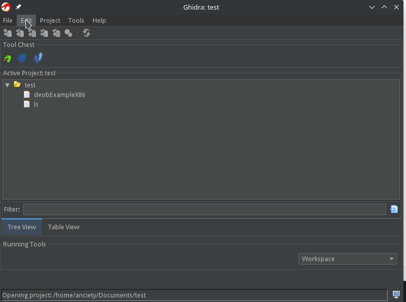
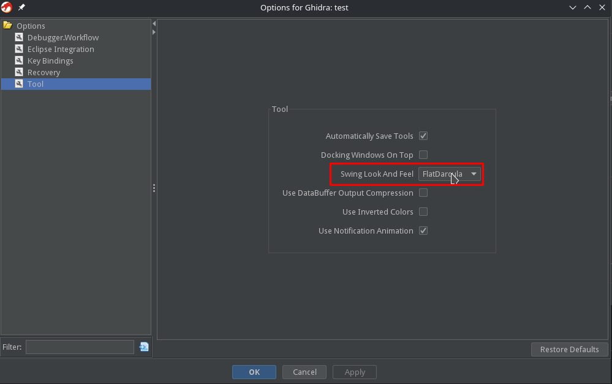
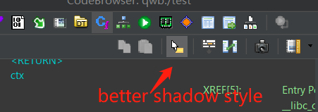
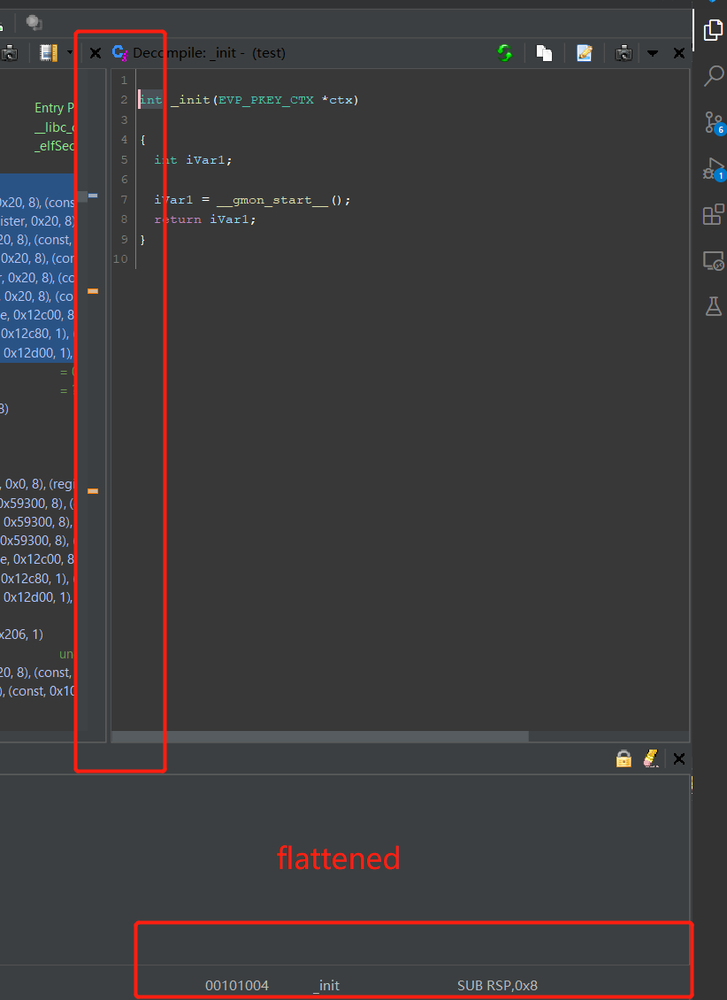

# Ghidracraft Dark Theme

Ghidracraft has dark theme on by default, but if you want to change the theme, you can always go to the option for Ghidra and change it.

The name of the dark theme is called `FlatDarcula`, one of the theme provided by [FlatLaf](https://www.formdev.com/flatlaf/).

## Change The Theme

To change the theme, you can go to the main window, goto `edit -> Tool Options`:

Then go to the Tool tab:

FlatDarcula is the name of our theme.

You can also choose other theme here.
But some of the colors might not work under other themes.
It is possible that you cannot see the characters.

To fix that, you will need to change some of the colors in the properties file.
Check out [color configuration](./color_configuration.md) for more information.

## What changed?

Some show cases, if any of you cares.

- Button shadow is now in modern style

- More flattened stylings

