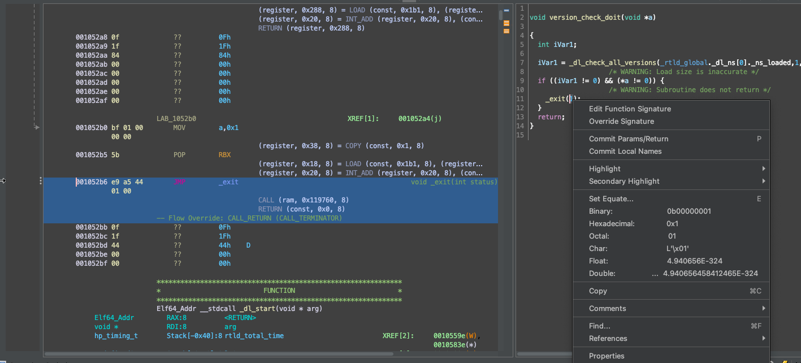

# Decompiler Improvements

We have done some minor decompiler improvements.
Note that some of the "improvements" are possible to break things. If so, please [fire an issue](https://github.com/StarCrossPortal/ghidracraft/issues).

## `CONCAT` rewrite rule

A rule is added to rewrite `CONCAT` magic function into more understandable operations.

TODO: show case

## Float display in decompiler panel

Now right click on a constant in decompiler panel, it is possible to convert to float and double now.

Before:

After:

## Add parenthesis around bit-wise operations

Before this, bit-wise operations mixed with normal add/sub like arithmatic operations can be a little bit hard to understand due to C's weird priority.

TODO: show case